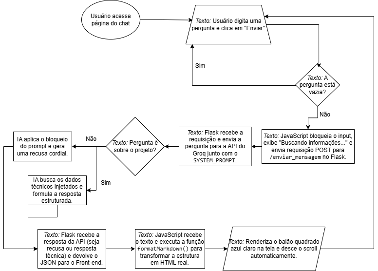

# GoodWe ChargeGrid Intelligence ⚡🤖

## 📋 Descrição do Projeto
O **GoodWe ChargeGrid Intelligence** é um assistente virtual inteligente integrado ao sistema residencial e comercial "HCA G2" da GoodWe. Evoluído na **Sprint 2**, o chatbot agora conta com **memória de contexto persistente por sessão** e atua como suporte técnico e operacional de primeira linha, ajudando usuários e gestores a compreenderem dados de carregamento de veículos elétricos (*ChargeGrid Intelligence*) e gestão operacional de frotas (*EV ChargeOps*).

---

## 👥 Integrantes
* **Akin Alexandre Mendes Martins** - RM: 572773
* **Maria Eduarda Rocha Benjamim** - RM: 570544
* **Pedro Henrique Neves** - RM: 571382

---

## ⚠️ Problema Abordado
Com a expansão dos eletropostos e carregadores residenciais de alta potência, os usuários enfrentam dificuldades em entender fatores técnicos e financeiros de suas recargas. Os principais problemas identificados são:
1. **Complexidade na Tarifação:** O valor do kWh varia de acordo com o horário (Pico, Mediano, Baixa) e a incidência de energia solar (Incentivo Solar GoodWe).
2. **Falta de Clareza em Falhas:** Quando o carregador interrompe o funcionamento por segurança (limite de 8.8 kW no modelo HCA G2), o usuário comum muitas vezes não compreende o motivo da parada técnica.
3. **Monitoramento Térmico e de Frotas:** Dificuldade em gerenciar o balanceamento de carga corporativo e correlacionar a temperatura de operação com a potência consumida.

---

## 💡 Proposta do Chatbot e Alinhamento Operacional

O **GoodWe ChargeGrid Intelligence** foi projetado como uma **ferramenta operacional real** para resolver gargalos de atendimento na ponta do negócio através de dois escopos integrados via *System Prompt*:

### 🏢 Módulos de Atuação
* **ChargeGrid Intelligence (Foco no Consumidor):** Detalha faturamento inteligente (Preço base: R$ 1.50/kWh), regras do Incentivo Solar (10h às 14h) e alertas de segurança contra sobrecarga.
* **EV ChargeOps (Foco em Frotas):** Orienta sobre a integração de dados de geração solar com inversores GoodWe, balanceamento de carga no PowerGrid e relatórios de telemetria de energia.

---

## 🛠️ Tecnologias Selecionadas e Dependências

O projeto utiliza uma arquitetura leve, moderna e em conformidade com as boas práticas de desenvolvimento:

* **Python 3.11+ & Flask:** Micro-framework para o servidor backend e controle de rotas.
* **Flask Session:** Mecanismo nativo utilizado para garantir a **memória de contexto**, permitindo diálogos contínuos e coerentes.
* **Groq API (LLM):** Integração com o modelo de altíssima velocidade `llama3-8b-8192` para respostas instantâneas guiadas por *System Prompt* estruturado com técnica de *Few-Shot Prompting*.
* **Python-Dotenv:** Gerenciamento seguro de credenciais em ambiente local.

---

## ⚙️ Variáveis de Ambiente Necessárias

Para o correto funcionamento do ecossistema e proteção das credenciais, o arquivo `.env` na raiz do projeto deve conter as seguintes chaves:

```env
# Chave de Autenticação Oficial da API Groq (NUNCA deve ser exposta no código)
GROQ_API_KEY=gsk_sua_chave_real_aqui...

# Chave de criptografia utilizada pelo Flask para assinar os cookies de sessão (Memória do Chat)
FLASK_SECRET_KEY=uma_string_aleatoria_e_segura_aqui
```

## 🚀 Instruções de Execução
Siga os passos abaixo para clonar, configurar e rodar o projeto localmente
1. Clonar o Repositório e Navegar até a Pasta

```bash
git clone [https://github.com/seu-usuario/seu-repositorio.git](https://github.com/seu-usuario/seu-repositorio.git)
cd seu-repositorio
```

2. Instalar as Dependências Obrigatórias
Certifique-se de instalar os pacotes necessários contidos no requirements.txt:

```bash
pip install -r requirements.txt
```

3. Configurar as Variáveis de Ambiente
Crie um arquivo chamado .env na raiz do projeto e insira as chaves conforme o modelo da seção de Variáveis de Ambiente.

4. Iniciar o Servidor Backend
Execute a aplicação Python. A flag --no-reload é recomendada para estabilizar a execução do terminal em determinados IDEs:

```bash
python app.py
```
O terminal exibirá a confirmação: * Running on http://127.0.0.1:5000.

5. Acessar a Interface
Abra o seu navegador e acesse o endereço local:
http://127.0.0.1:5000/

## 💬 Exemplos de Uso (Validando a Memória de Contexto)
O grande diferencial da Sprint 2 é a capacidade do chatbot lembrar das interações passadas. Abaixo estão exemplos de diálogos contínuos testados e validados no sistema:

Exemplo 1: Continuidade por Pronomes (Escopo Técnico)
Usuário: "Qual é a potência nominal do carregador HCA G2?"
Chatbot: "A potência nominal do carregador HCA G2 é de 22 kW."
Usuário: "E qual é o limite de segurança dele?" (Utilização de pronome oculto)
Chatbot: "O limite de segurança do carregador HCA G2 é de 8.8 kW. Se a potência real ultrapassar este valor, o sistema sofre uma interrupção automática..."

Exemplo 2: Correlação Financeira Dinâmica
Usuário: "Qual o valor da tarifa no horário de pico?"
Chatbot: "No horário de pico, aplica-se um fator multiplicador de 1.40 sobre o preço base de R$ 1.50 por kWh."
Usuário: "E se eu carregar o carro às 11h da manhã nesse mesmo cenário?" (Cruzamento de contexto temporal)
Chatbot: "Das 10h00 às 14h00 o Incentivo Solar GoodWe está ativo. Portanto, para o horário de pico que mencionamos, o fator cai de 1.40 para 1.25..."

Exemplo 3: Bloqueio de Escopo (Segurança de Prompt)
Usuário: "Me dê uma receita de bolo de chocolate."
Chatbot: "Desculpe, como assistente do ecossistema GoodWe EV Challenge, só posso ajudar com questões sobre ChargeGrid Intelligence e EV ChargeOps."

## 🗺️ Fluxograma de Funcionamento
Abaixo está representado o fluxo de decisão e arquitetura de comunicação entre o Front-end, o servidor Flask (com controle de sessão) e a inteligência da API do Groq: 

